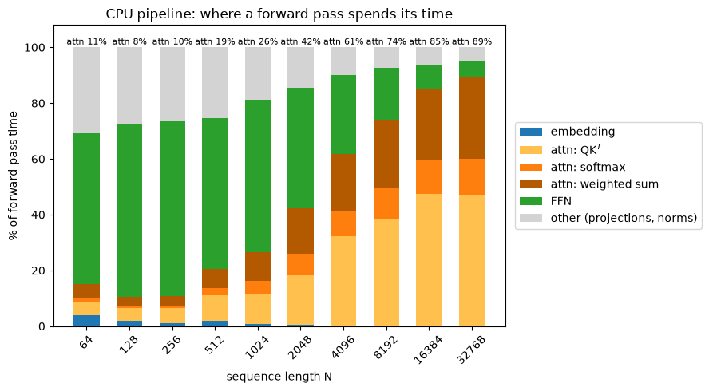
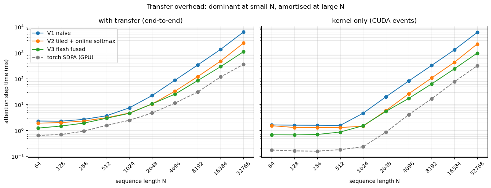
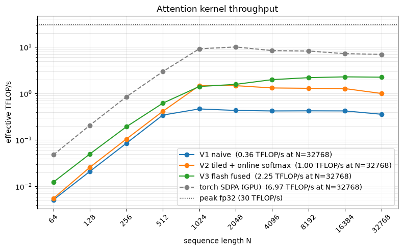
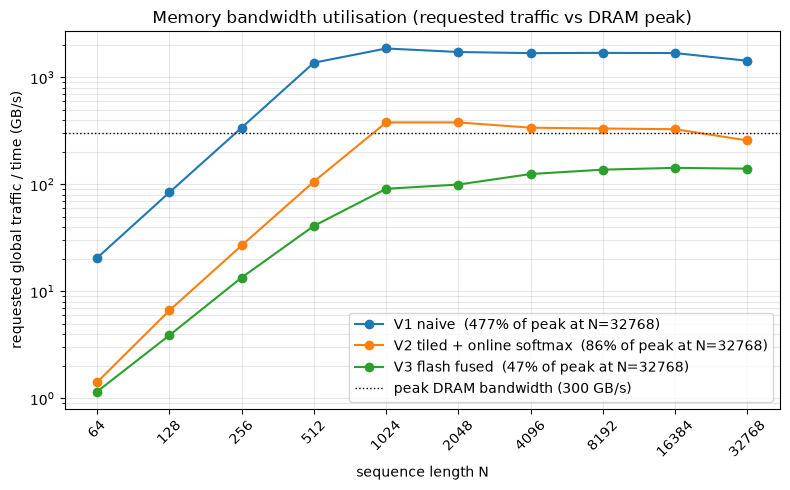
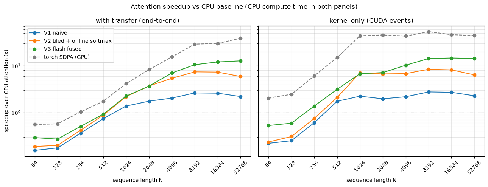

# B3 · Transformer Attention Mechanism — Report

Scaled dot-product attention from scratch in numba CUDA, optimised in three steps.
Only the profiled bottleneck moves to the GPU; embedding, projections, norms and FFN
stay in PyTorch on the CPU.

Measured on an **NVIDIA L4** (30.3 TFLOP/s fp32, 300 GB/s) with a 4-vCPU host.

## 1. Finding the bottleneck

Profiled the CPU pipeline with `torch.profiler` (`record_function` per stage).
Attention is O(N²D); everything else is O(N).



Attention grows from 10% of the forward pass (N=64) to **89%** (N=32768) — it is the
only step worth parallelising.

## 2. Implementations

All versions implement `attention(q, k, v)` and must match torch SDPA within 1e-4
(`tests/test_correctness.py`). `gpu_base.py` handles transfers + sync.

| Version | Design | Key point |
|---|---|---|
| CPU | torch ops (MKL) | optimised baseline, ~150 GFLOP/s — not a naive loop |
| V1 `gpu_v1.py` | 4 naive kernels: QKᵀ, scale, softmax, weights·V | one thread/output, coalesced loads, N×N matrix round-trips global memory; 3-pass softmax |
| V2 `gpu_v2.py` | tiled QKᵀ + online softmax | 16×16 shared tiles (+1 pad, no bank conflicts) → operands fetched 16× less; scaling fused; softmax gets (max, sum) in one read via log-sum-exp |
| V3 `gpu_v3.py` | FlashAttention-style fused kernel | one warp per 4 query rows; K/V tiles in shared memory; q/output in lane registers — each shared load feeds 4 FMAs; `shfl_xor_sync` dot-product reduction; online softmax rescales the accumulator; **no N×N matrix, O(N) memory** |

Numba gotchas hit: no builtin `min()` in kernels; shared array shapes must be plain
constants; Python-float kernel args silently promote fp32 loops to fp64 (pass
`np.float32`); tensors must be `detach()`ed.

## 3. Timing

Per HW01: warm up first (JIT), CUDA events + `synchronize` for kernel-only times,
wall clock only with a sync inside every rep. End-to-end times deliberately include
CPU↔GPU transfers — the real cost of the swap.

Cautionary tale: an early benchmark closed its timer before syncing → GPU "time" flat
at ~1 ms from N=64 to 16384 (implies 6,300 TFLOP/s). It measured kernel *launches*.
If the curve doesn't move when work grows 10⁶×, the timer is broken.

Transfer cost (V3): 71% of the call at N=512 → **11%** at N=32768 (O(N) transfer vs
O(N²) compute). ~2.2 GB/s effective — pageable PCIe; pinned memory would double it.



## 4. Metrics

**TFLOP/s** = counted FLOPs ÷ CUDA-event kernel time.
FLOPs(N) = `4N²D + 5N²` (two matmuls at 2N²D + softmax).
Peak = SMs × cores/SM × 2 × clock (`bench.gpu_specs()`).
V3 at 32K: 2.20 TFLOP / 0.98 s = **2.25 TFLOP/s = 7.4% of peak**.



**Bandwidth utilisation** = modelled global-memory bytes ÷ time, vs peak
(mem clock × bus width/8 × 2; bus width read from NVML).

| Version | Bytes moved | Why |
|---|---|---|
| V1 | `4(4N²D + 6N²)` | operands re-requested per output |
| V2 | `4(4N²D/16 + 4N²)` | 16× tile reuse |
| V3 | `4(N²D/16 + 2ND)` | K/V streamed once per block |

Caveat: these are *requested* bytes. Caches serve V1's redundancy, so its rate sits
above the DRAM ceiling (470%) — hence the chart plots GB/s vs the peak line, not "%".
(Ground truth: `ncu dram__bytes.sum`.)



**Roofline**: AI = FLOPs/byte. Ridge = 30,300/300 ≈ 101 FLOP/B; all versions are far
below → memory-bound. V1→V3 is a climb up this axis: AI ≈ 0.25 → 4 → 16.
**V2 runs at 84% of the DRAM ceiling** (done — memory wall); **V3 is faster at 47%**
— it wins by moving less data. That is FlashAttention's argument in one chart.

## 5. Results

End-to-end (incl. transfers), L4 vs 4-vCPU MKL:

| N | CPU | V1 | V2 | V3 | SDPA |
|---:|---:|---:|---:|---:|---:|
| 2048 | 39 ms | 22 ms | 10.6 ms | 10.7 ms | 4.7 ms |
| 8192 | 899 ms | 341 ms | 121 ms | 85 ms | 31 ms |
| 32768 | 14104 ms | 6399 ms | 2381 ms | **1104 ms** | 361 ms |



Insights:

- Below N≈512 the GPU loses: launch + PCIe overhead exceeds the whole computation.
  The gap between the two panels *is* the transfer cost.
- V1 ≈ 2×: naive-but-coalesced barely beats multi-core MKL. Wins come from reuse
  (V2: 5.9×) and fusion (V3: 12.8×; 14.4× kernel-only).
- V3 beats V2 from N≈4096 with half the DRAM traffic.
- The ~3× gap to SDPA is machinery numba can't express (vectorised loads, async
  pipelines, tensor cores). SDPA itself only hits 23% of fp32 peak here.
- Speedup depends on the pairing: same code gives SDPA 39× (L4 vs 4-core),
  12× (H100 vs 128-core Xeon), ~130× (H100 vs 4-core). Published "50–300×" numbers
  assume datacenter GPU + modest CPU + fp16 tensor cores.

## Reproduce

```sh
uv sync
uv run pytest                          # correctness vs torch SDPA (1e-4)
jupyter lab notebooks/attention.ipynb  # GPU cells self-skip without CUDA
```
